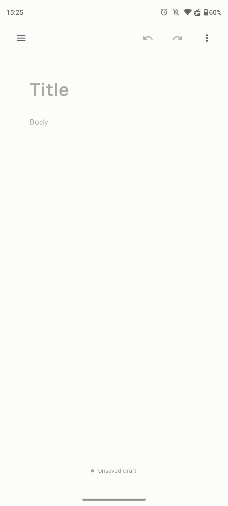
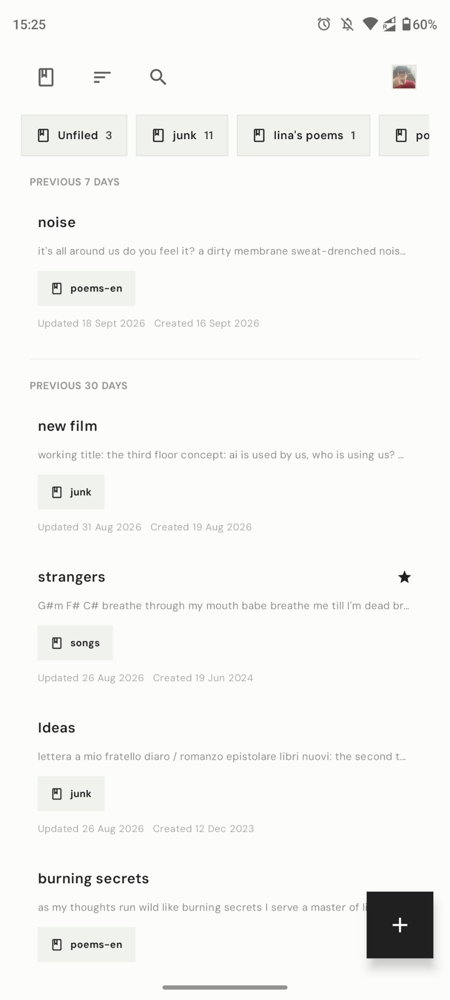
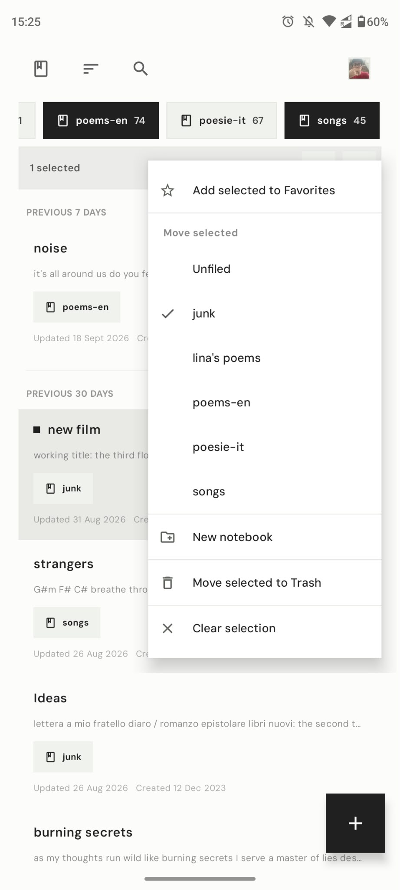
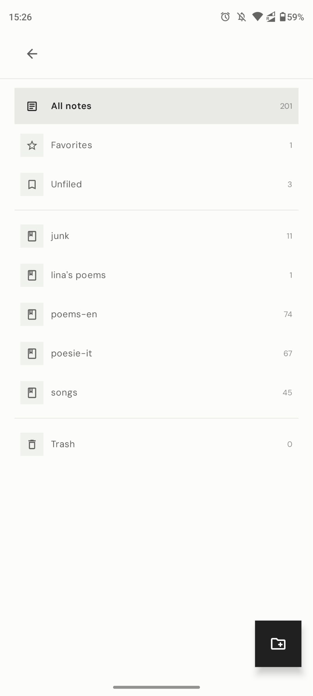

<p align="center">
  
</p>

<h1 align="center">author</h1>

<p align="center">A minimal, local-first, self-hostable notes app for writers.</p>

<p align="center">
  <a href="docs/self-hosting.md">Self-hosting</a> ·
  <a href="apps/android/README.md">Android</a> ·
  <a href="docs/setup.md">Setup</a> ·
  <a href="SECURITY.md">Security</a> ·
  <a href="CONTRIBUTING.md">Contributing</a>
</p>

<p align="center">
  <a href="https://github.com/ivanarena/author/actions/workflows/ci.yml"></a>
  <a href="https://github.com/ivanarena/author/actions/workflows/security.yml"></a>
  <a href="https://github.com/ivanarena/author/actions/workflows/docker.yml"></a>
  <a href="LICENSE"></a>
</p>

<p align="center">
  <a href="docs/screenshots/android-editor.jpeg"></a>
  <a href="docs/screenshots/android-notes-scrolled.jpeg"></a>
  <a href="docs/screenshots/android-note-actions.jpeg"></a>
  <a href="docs/screenshots/android-notebooks.jpeg"></a>
</p>

## Highlights

**author** aims to reduce friction as much as possible: it opens directly into the editor and saves locally before using the network, staying in sync between devices. It is designed for writers, keeping the feature set extremely minimal to reduce distractions and let the user focus on the writing. The main features include:

- Plain-text notes with notebooks, favorites, trash, search, and local history
- Offline-first browser storage and an encrypted Android SQLCipher database
- Client-encrypted notes, notebook names, and account keyrings
- Explicit version conflicts instead of silent remote overwrites
- Markdown ZIP import/export
- Docker/SQLite self-hosting, optional Turso mirroring, and Cloudflare Workers support

> author does not claim independently audited cryptography or protection from malicious hosted web JavaScript. Read the [security policy and threat model](SECURITY.md) before relying on it for sensitive data.

## Self-host

Use a tagged [release](https://github.com/ivanarena/author/releases) and read the complete [self-hosting guide](docs/self-hosting.md) before exposing author to a network.

```sh
git clone https://github.com/ivanarena/author.git
cd author
git checkout vX.Y.Z
cp .env.example .env
chmod 600 .env
$EDITOR .env
docker compose up -d --build
curl --fail http://127.0.0.1:3000/api/health
```

Replace every placeholder secret in `.env` and put a trusted HTTPS reverse proxy in front of the app. See [operations](docs/operations.md) for backups, restores, monitoring, and upgrades.

## Develop

author requires Node.js 24.12+ and [Aube](https://github.com/endevco/aube) 1.16.

```sh
curl https://mise.run | sh
mise use -g node@24
mise use -g aube@1.16.0
cp apps/web/.env.example apps/web/.env
aube install
aube -F @author/web run dev
```

Useful checks:

```sh
aube run quality
aube run test
aube run test:e2e
aube run android:verify
```

The repository uses Aube and `aube-lock.yaml`; see the [package-manager guide](docs/package-manager.md). For Android builds and signing, see the [Android README](apps/android/README.md).

## Project

- [`apps/web`](apps/web) — SvelteKit web app, IndexedDB client, Hono API, and SQLite/libSQL server
- [`apps/android`](apps/android) — Kotlin/Compose app with SQLCipher and WorkManager sync
- [`packages`](packages) — shared schemas, API contracts, sync rules, and test fixtures
- [`docs`](docs) — architecture, protocol, deployment, and operations guides

Start with the [project structure](docs/project-structure.md), [sync protocol](docs/sync-protocol.md), or [conflict handling](docs/conflict-handling.md).

## License

[MIT](LICENSE) © Ivan Arena. See [asset provenance](ASSET_PROVENANCE.md) and [third-party notices](THIRD_PARTY_NOTICES.md).
